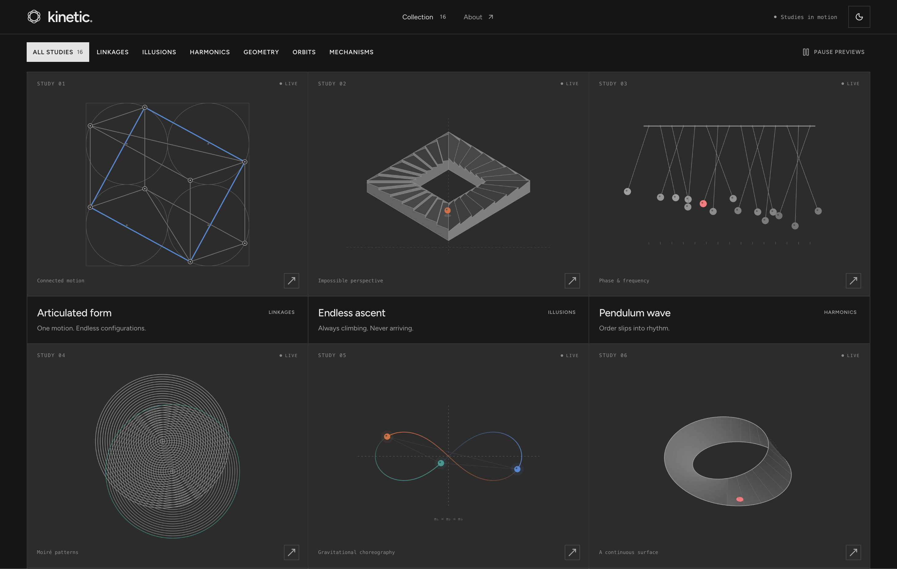

# Kinetic

**Studies in motion.** A collection of interactive kinetic art studies — pendulum waves, Möbius strips, rolling polyhedra, Chladni patterns — each driven by a handful of simple rules and rendered live in the browser.



Every study animates continuously, exposes a parameter you can tune, and links to a detail page where you can pause, scrub the speed, and toggle construction guides.

## Quick start

```bash
pnpm install
pnpm dev
```

The site runs at [localhost:3000](http://localhost:3000).

## Scripts

| Command                     | What it does                                             |
| --------------------------- | -------------------------------------------------------- |
| `pnpm dev`                  | Dev server on port 3000                                  |
| `pnpm build`                | Production build — prerenders every route to static HTML |
| `pnpm preview`              | Serve the build with Vite                                |
| `pnpm preview:workers`      | Serve the build with the real Cloudflare Workers runtime |
| `pnpm deploy:dry`           | Build and validate the deploy without publishing         |
| `pnpm deploy`               | Build and deploy to Cloudflare Workers                   |
| `pnpm test`                 | Run the Vitest suite                                     |
| `pnpm typecheck`            | `tsc --noEmit`                                           |
| `pnpm lint` / `pnpm format` | ESLint / Prettier                                        |

## How it works

**Two renderers, one component.** [`Artwork`](src/components/artwork.tsx) picks between them per study:

- **2D canvas** — the default. A `draw(ctx, study, time, parameter, guides)` function dispatches on `study.kind` and paints each frame.
- **WebGL** via [`Artwork3D`](src/components/three/artwork-3d.tsx) — opt-in with the `spatial` prop, used only on study detail pages. The eight kinds listed in [`scenes.ts`](src/components/three/scenes.ts) have Three.js scenes, including the rigid-panel Miura fold and the gravity well.

WebGL is opt-in because each canvas holds its own GL context, and browsers evict the oldest once you exceed a low cap. The collection grid renders every card through the 2D path, so the collection of twenty-six studies costs zero GL contexts. Detail pages mount exactly one.

**Content is data.** [`src/lib/studies.ts`](src/lib/studies.ts) is a plain array — title, category, `kind`, parameter range, copy. Routing, the collection grid, the category filters, and the header count all derive from it.

**The math is separate from the drawing.** Geometry helpers live in [`src/lib/`](src/lib/) (`kinetic-math`, `rolling-cube`, `geometric-studies`, …) and are unit-tested independently of any canvas, which is why the suite runs without a browser.

The newest studies explore a Geneva drive’s intermittent rotation, a Miura sheet’s coordinated folding, recursive branching, and collective motion. The flock uses a seeded, fixed-step simulation owned by each artwork; resetting or changing alignment restores the same starting arrangement. Construction guides reveal its local neighborhoods, while the other studies expose their geometric construction.

The gravity well is the exception to stepping state forward: orbits in a central potential repeat radially, so each body integrates one apoapsis-to-apoapsis period when the mass changes and every later moment is a lookup plus a known rotation. Scrubbing, resetting, and the 2D and WebGL views all agree on where each body is.

The prism traces rays exactly rather than drawing a picture of a spectrum: each wavelength gets its own refractive index from Cauchy's equation, bends by Snell's law at every face, and reflects when it meets a face beyond the critical angle.

## Rendering and deployment

The build prerenders to static HTML — no server at runtime. `crawlLinks` starts at `/` and follows the collection grid's links, so every study page is emitted automatically and new studies need no build config.

Output lands in `dist/client/` and deploys to Cloudflare Workers as static assets. [`wrangler.jsonc`](wrangler.jsonc) declares no `main` script, so no Worker code runs and static-asset requests are free and unlimited.

## Stack

[TanStack Start](https://tanstack.com/start) (router + SSR/prerender) · React 19 · TypeScript · Three.js · Tailwind CSS 4 · shadcn/ui · Vite · Vitest · Cloudflare Workers

## Contributing

Kinetic is open source — the code lives at [github.com/mnove/kinetic](https://github.com/mnove/kinetic), created by [mnove](https://github.com/mnove).

Adding a study, adjusting the math, or fixing a rendering bug — see [CONTRIBUTING.md](CONTRIBUTING.md).
